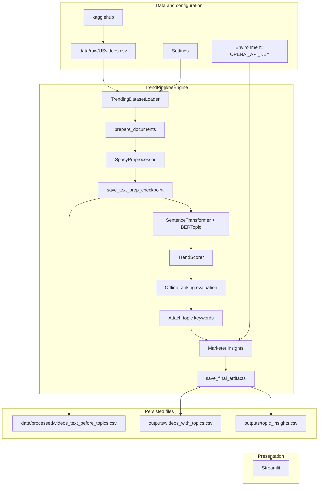
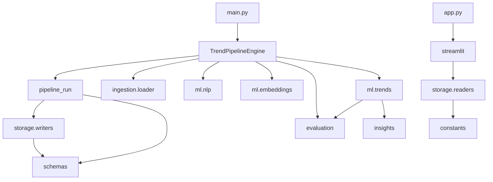

## Mailchimp Trend Engine — Architecture

### 1. Purpose and scope

This document describes the runtime structure of the Mailchimp Trend Engine: package boundaries, principal data flow, machine-learning stages, persisted artifacts, and how CSV exports relate to Pydantic validation.

A narrative tour of the same stages, with a small numeric example, is in [ml_guide.md](ml_guide.md).

Authoritative column and file names for pipeline exports are defined in `src/constants/pipeline_io.py`. The pipeline runs in a single OS process; there is no message broker or external job scheduler in this repository.

### 2. Package layout

Layers follow the dependency order of the implementation.

| Layer | Path | Responsibility |
|-------|------|----------------|
| Orchestration | `src/pipeline/` | `TrendPipelineEngine` and ordered steps in `pipeline_run.py` |
| Ingestion | `src/ingestion/` | Dataset acquisition and tabular load |
| Machine learning | `src/ml/` | Text normalization, embeddings, topic modeling, scoring, per-topic enrichment |
| Evaluation | `src/evaluation/` | Proxy NDCG; standard demo output before LLM calls (`log_ranking_evaluation`; console can be suppressed for automation) |
| Language model | `src/insights/` | OpenAI client and JSON handling for insight generation |
| Persistence | `src/storage/` | CSV writers for checkpoints and finals; CSV readers for the dashboard |
| Presentation | `src/serving/streamlit/` | Streamlit UI and dashboard-specific transforms |
| Contracts | `src/schemas/`, `src/constants/` | Row models, validators, prompts, thresholds, literals |

Entry points: `main.py` runs the pipeline; `app.py` starts Streamlit. The same call sequence appears stepwise in `notebooks/trend_pipeline_walkthrough.ipynb`.

### 3. End-to-end data flow

The diagram below summarizes control and data movement from download through artifact generation to the UI.

The text-prep checkpoint (`videos_text_before_topics.csv`) is written after spaCy normalization and before embedding and topic assignment. The Streamlit app requires `outputs/topic_insights.csv`. `outputs/videos_with_topics.csv` is optional for the dashboard loader.

### 4. Machine-learning and enrichment stages

Execution order matches `TrendPipelineEngine` ([`src/pipeline/trend_engine.py`](../src/pipeline/trend_engine.py)). A worked example is in [ml_guide.md](ml_guide.md).

`DEFAULT_TREND_PIPELINE_STEPS` ([`pipeline_run.py`](../src/pipeline/pipeline_run.py)) prints **ten** console titles (Steps 1–10). Steps 6–9 map to `TrendPipelineEngine` methods: `score_topic_aggregates` → `log_topic_ranking_evaluation` → `attach_topic_keywords` → `enrich_marketer_insights`. Entry point `main.py` uses `TrendPipelineEngine.run()` → `run_trend_pipeline` with this full sequence.

| # | Stage (console label) | Columns / artifacts | Implementation |
|---|--------|----------------------|----------------|
| 1 | Step 1: Load dataset | Input CSV → in-memory frame | `TrendingDatasetLoader.load`, `validate_trending_video_rows` |
| 2 | Step 2: Build documents | Adds `document` | `prepare_documents` → `build_document` |
| 3 | Step 3: spaCy normalization | Adds `cleaned_text` | `enrich_documents` → `SpacyPreprocessor.transform` |
| 4 | Step 4: Save text-prep checkpoint | `videos_text_before_topics.csv` | `save_text_prep_checkpoint` |
| 5 | Step 5: Embeddings + topic assignment | Adds `topic`, `topic_confidence` | `EmbeddingService.encode`, `TopicModeler.fit_transform` |
| 6 | Step 6: Trend scoring | Per-topic aggregates; excludes `topic == -1` | `score_topic_aggregates` → [`TrendScorer.score`](../src/ml/trends/trend_scorer.py) |
| 7 | Step 7: Offline ranking evaluation | Console metrics (proxy NDCG; uses blended gain vs `trend_score`) | `log_topic_ranking_evaluation` → [`log_ranking_evaluation`](../src/evaluation/reporting.py) |
| 8 | Step 8: Attach topic keywords | `topic_keywords`, `topic_label`, … | `attach_topic_keywords` → [`add_topic_keyword_columns`](../src/ml/trends/topic_insight_enrichment.py) |
| 9 | Step 9: Marketer insights | `summary`, `campaign_copy`, … | `enrich_marketer_insights` → [`enrich_topic_insights_marketer_fields`](../src/ml/trends/topic_insight_enrichment.py) |
| 10 | Step 10: Save final outputs | `videos_with_topics.csv`, `topic_insights.csv` | `save_final_artifacts` |

Replay Step 7 metrics from CSV: `python -m src.evaluation outputs/topic_insights.csv`.

Scoring (stage 6): topic-level proxy features (volume, momentum, engagement, proxy CTR, freshness) are blended with a non-personalized LambdaMART score. Training uses date-grouped pseudo-relevance from next-day topic lift; final `trend_score` is a stability blend (`lambdamart_blend_alpha`) of learned and anchor signals, with anchor-only fallback when learned ranking is unavailable or under-supported.

Topic identifiers: `topic` integers are run-scoped, not stable across runs.

### 5. High-level module dependency

### 6. Artifacts and schema contracts

#### 6.1 Files produced

| Directory | File name | Contents (summary) |
|-----------|-----------|----------------------|
| `data/raw/` | Region CSV (default `USvideos.csv`) | Raw Kaggle export after download. |
| `data/processed/` | `videos_text_before_topics.csv` | Input metrics plus `document` and `cleaned_text` prior to topic assignment. |
| `outputs/` | `videos_with_topics.csv` | Per-video metrics with `topic` and `topic_confidence`. |
| `outputs/` | `topic_insights.csv` | One row per scored topic: metrics, keywords, LLM fields, nested `campaign_copy`. |

#### 6.2 Join semantics

Within one pipeline run and working directory, `videos_with_topics.topic` matches `topic_insights.topic` for the same logical cluster.

#### 6.3 Validation and versioning

| Concern | Location |
|---------|----------|
| Export column order and file names | `src/constants/pipeline_io.py` |
| Logical row types | `src/schemas/trending_input.py`, `video_topic.py`, `topic_insights.py` |
| CSV round-trip validation at write time | `src/schemas/converters.py` |
| Semantic version of the export contract | `PIPELINE_SCHEMA_VERSION` in `src/schemas/version.py` |

Column-level definitions are authoritative in `pipeline_io.py` and the Pydantic models; this document does not duplicate those tables.
